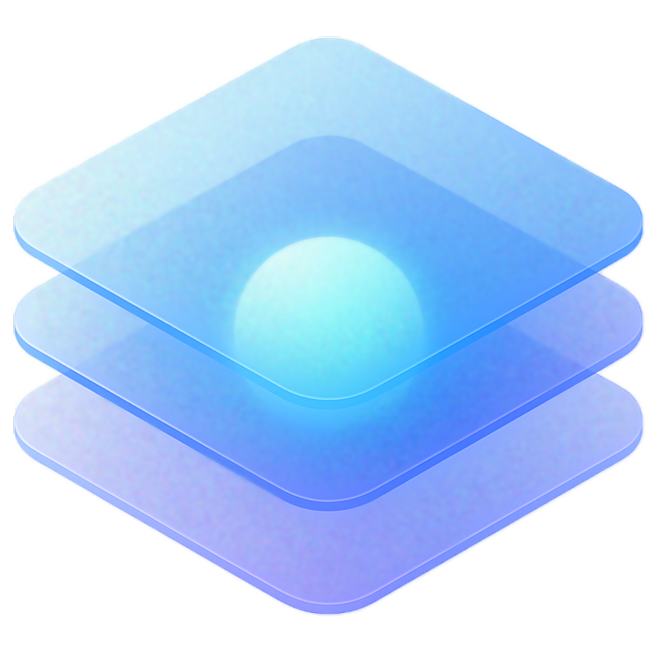
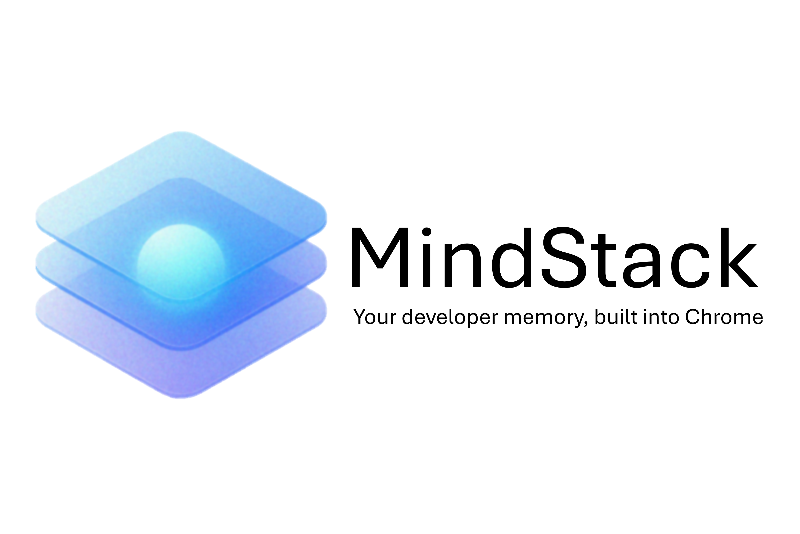
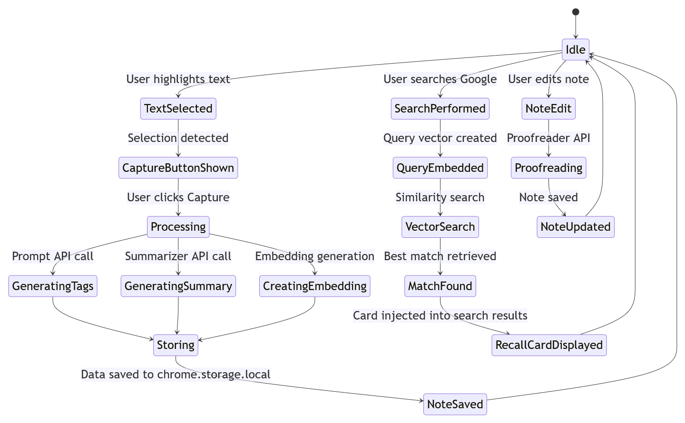
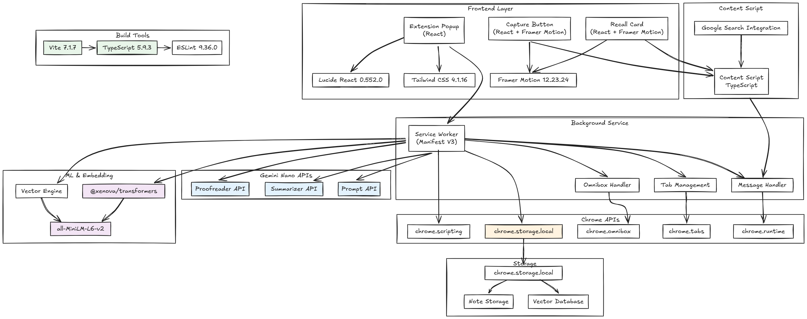

# **MindStack**

<div align="center">
  

**Your developer memory, built into Chrome.**

*Cheat sheets that build themselves — and return when you search. All local. All private.*

</div>

---

## 🚀 Overview

<div align="center">
  
</div>

Chrome remembers the sites you’ve visited — **but not what you learned there.**
You find the perfect fix, close the tab, and weeks later you’re searching for the same solution again.

**MindStack fixes that loop.**
It turns Chrome into your *developer memory*: capturing what you learn, summarizing it with **Gemini Nano**, and automatically resurfacing it when you face a similar problem — all locally.

Here’s how it works: highlight a solution, and MindStack captures it. It generates a summary and smart tags using Chrome’s built-in AI, then embeds them locally for instant recall.
When you Google something similar later, your own cheat sheet quietly reappears — powered by on-device embeddings.

**No setup. No cloud. No rediscovery. Just Chrome that remembers.**

> Not a note-taking tool, a new kind of memory — personal, automatic, and seamless.

---

## ✨ Features

* **🎯 Automatic Capture** — Highlight solutions and capture them with one click.
* **🏷️ Smart Tagging** — AI-generated tags and summaries using Gemini Nano.
* **🔍 Intelligent Recall** — Surfaces your saved fixes when you search for similar issues — no digging twice.
* **🔒 Fully Local** — All data stored in `chrome.storage.local`; works offline, no cloud required.
* **✏️ Evolving Notes** — Refine your notes anytime with Proofreader API assistance.
* **⚡ Instant** — Client-side vector search with smooth, native animations.
* **🚀 Zero Setup** — Cheat sheets that build themselves and return when you need them.

---

## 🧠 RECALL — The MindStack Philosophy

**R — Reason**
Every developer knows the feeling: you fix a bug, feel clever for a moment… and then two weeks later you’re staring at the same Stack Overflow post again. That loop of rediscovery sparked MindStack.

**E — Experience**
Highlight a solution. Click “Capture.” MindStack saves, summarizes, and tags it with Chrome’s on-device AI. Weeks later, it recognizes the same problem and surfaces your saved fix directly beside the search results.

**C — Construction**
Built with **React**, **Vite**, and **TypeScript** under **Manifest V3**.
MindStack uses Gemini Nano’s Prompt, Summarizer, and Proofreader APIs to generate concise tags and explanations, then embeds them locally with **Xenova/all-MiniLM-L6-v2**.
Everything — notes, vectors, and metadata — lives in `chrome.storage.local` for full offline recall.

**A — Artistry**
Subtlety was our obsession. MindStack feels like part of Chrome — not another overlay or chatbot. We refined animations, asynchronous behavior, and UI transitions to make the experience feel *native* and invisible.

**L — Lessons**
Working fully client-side taught us that privacy, latency, and UX are one problem.
True intelligence doesn’t need to announce itself — it just works, silently.

**L — Leverage**
Next, we aim to make MindStack project-aware — grouping notes by repository and syncing (optionally, encrypted) with tools like Obsidian. The goal remains simple: **a browser that remembers, quietly.**

---

## 🧩 Installation

### Prerequisites

* Node.js ≥ 18
* pnpm
* Google Chrome (latest version)

### Enable Gemini Nano APIs

Before installing, enable the Proofreader API:

1. Visit `chrome://flags/#proofreader-api-for-gemini-nano`
2. Set to **Enabled**
3. Click **Relaunch**

### Build the Extension

```bash
pnpm install
pnpm build
```

The extension will be built in the `dist` folder.

### Load in Chrome

1. Open `chrome://extensions/`
2. Enable **Developer mode**
3. Click **Load unpacked** and select `dist`

---

## ⚙️ How It Works

<div align="center">
  
</div>

1. **Capture** — Highlight a solution or snippet; a “Capture” button appears.
2. **Process** — Gemini Nano summarizes and tags it locally.
3. **Store** — MindStack embeds the note using local vectors and saves it in `chrome.storage.local`.
4. **Recall** — When you Google something similar, MindStack matches the query and resurfaces your cheat sheet in real time.

---

## 🛠️ Tech Stack

<div align="center">
  
</div>

* **React** – Interface
* **Vite** – Build system
* **TypeScript** – Type safety
* **Gemini Nano APIs** – On-device AI (Prompt, Summarizer, Proofreader)
* **Xenova/all-MiniLM-L6-v2** – Local embeddings for semantic recall
* **Framer Motion** – Smooth animations
* **Tailwind CSS** – Styling
* **Chrome Manifest V3** – Extension platform

---

## 💻 Development

```bash
pnpm dev      # Start in development mode
pnpm build    # Build production bundle
pnpm lint     # Check code style
pnpm preview  # Preview built extension
```

---

## 🔒 Privacy & Security

MindStack is fully local:

* No network calls or external APIs
* All AI runs on-device with Gemini Nano
* Data stored only in Chrome’s local storage
* Works offline — private by design

---

## 🧭 Future Plans

* Project-aware note grouping (by repo)
* Obsidian and IDE integrations
* Advanced semantic recall
* Optional encrypted cross-device sync

---

## 📜 License

MIT

---

## 🤝 Contributing

Contributions are welcome! Please open an issue or pull request.

---

## 🌐 Repository

[**GitHub → MindStack**](https://github.com/mounirLbath/MindStack)

---

<div align="center">
  Made with ❤️ by the MindStack team
</div>
